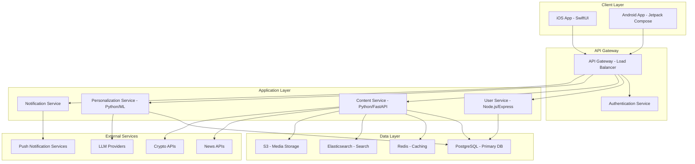
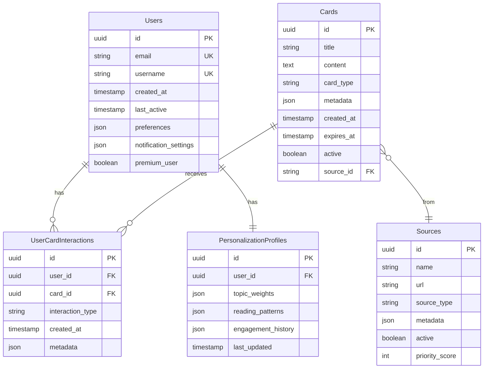
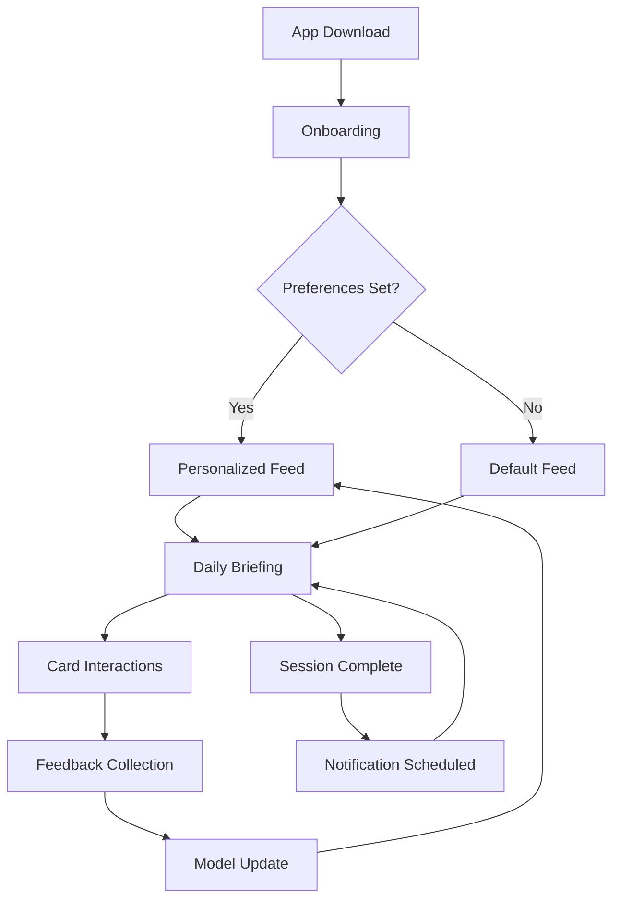

# PulseX - Daily AI Briefing App
## Product Requirements Document (PRD)

**Version:** 1.0
**Date:** December 2024
**Author:** Product Team
**Status:** Draft

---

## Executive Summary

PulseX is a mobile-first daily briefing application that delivers personalized, bite-sized content cards on AI, cryptocurrency, politics, and focus topics in 30-90 seconds per session. The app addresses the growing need for efficient information consumption in an increasingly complex world, providing users with curated insights that respect their time and cognitive load.

**Market Opportunity**: The daily news and briefings market represents a $12.4B opportunity, with mobile consumption growing 23% year-over-year. Current solutions either overwhelm users with information depth or lack personalization and relevance.

**Key Differentiators**:
- **Bite-sized format**: 30-90 second daily consumption
- **AI-powered personalization**: Dynamic content adaptation based on user preferences
- **Multi-domain coverage**: AI tech, crypto markets, political narratives, and personal focus
- **Neutral stance**: Balanced, informational content across all domains

---

## Product Vision

> "To empower informed decision-making by delivering personalized, concise daily briefings that fit seamlessly into users' lives."

### Core Principles
1. **Time Respect**: Every interaction designed for 30-90 second consumption
2. **Neutrality**: Balanced, factual content without political bias
3. **Privacy First**: User data protection as a foundational requirement
4. **Personalization**: Adaptive content based on individual preferences and behavior
5. **Accessibility**: Inclusive design for diverse user needs

---

## User Personas

### Primary Personas

**1. "Tech Professional Alex" - 32, Software Engineer**
- **Behaviors**: Busy professional, needs to stay current on AI trends and crypto markets
- **Goals**: Efficient information consumption, career development
- **Pain Points**: Information overload, lack of time for deep research
- **Usage Pattern**: Morning commute, 7-9 AM, seeks 2-3 key insights daily

**2. "Business Leader Sarah" - 45, Executive**
- **Behaviors**: Strategic decision-maker, needs political and market insights
- **Goals**: Stay informed on business-impacting trends, competitive intelligence
- **Pain Points**: Too many sources, difficulty separating signal from noise
- **Usage Pattern**: Multiple briefings throughout day, prefers executive summaries

**3. "Student Jordan" - 22, Graduate Student**
- **Behaviors**: Information-hungry, cost-conscious, mobile-first user
- **Goals**: Academic research support, career preparation
- **Pain Points**: Limited budget for premium news sources
- **Usage Pattern**: Flexible timing, prefers depth when available

### Secondary Personas

**4. "Retiree Robert" - 68, Financial Investor**
- **Behaviors**: Risk-averse, focuses on market stability and long-term trends
- **Goals**: Portfolio monitoring, understanding new technologies
- **Pain Points**: Technical complexity, information credibility concerns

---

## Product Features

### Version 1.0 - Core Features

#### 1. Daily Pulse Feed
**Priority**: Critical
**Effort**: High
**Description**: Main consumption interface delivering 5-8 personalized content cards daily

**Card Types**:
- **crypto_market**: Market trends, key movements, regulatory updates
- **ai_tech**: Breakthrough developments, industry news, research highlights
- **political_narrative**: Policy changes, electoral impacts, governmental shifts
- **daily_focus**: Personalized based on user interests and behavior
- **wildcard**: Emerging trends, cross-domain insights, surprise content

**Technical Requirements**:
- Swipe-based navigation with smooth transitions
- Read time estimation per card (30-90 seconds)
- Offline caching for completed cards
- Progressive image loading

#### 2. Onboarding & Personalization
**Priority**: Critical
**Effort**: Medium
**Description**: User setup process for preferences and personalization parameters

**Personalization Dimensions**:
- **Interest Areas**: Weight sliders for AI/crypto/politics/focus (0-100%)
- **Briefing Schedule**: Preferred time, frequency, reminder settings
- **Depth Level**: Surface overview vs. detailed insights
- **Content Sources**: Preferred publishers and topics

**Technical Requirements**:
- Progressive profiling (can be updated post-onboarding)
- Import from social media for interest detection
- A/B testing on onboarding flow

#### 3. Feedback & Tuning System
**Priority**: High
**Effort**: Medium
**Description**: User feedback mechanism to improve content relevance

**Feedback Types**:
- **Card-level**: Thumbs up/down with optional reason tags
- **Topic weighting**: Manual adjustment of interest area preferences
- **Source preferences**: Block/favor specific content sources
- **Timing feedback**: Optimal reading time suggestions

**Technical Requirements**:
- Real-time model retraining capability
- Feedback aggregation and analysis dashboard
- A/B testing framework for content variations

#### 4. Smart Notifications
**Priority**: High
**Effort**: Medium
**Description**: Intelligent reminder system respecting user preferences

**Notification Types**:
- **Daily Briefing Ready**: Morning/afternoon personalized reminders
- **Breaking Updates**: Critical developments in high-interest areas
- **Weekly Digest**: Summary of most engaging content

**Technical Requirements**:
- Time zone awareness
- Intelligent timing based on usage patterns
- Respect system notification preferences
- Deep linking to specific content

#### 5. Saved Cards & Collections
**Priority**: Medium
**Effort**: Low
**Description**: Bookmarking system for important content

**Features**:
- One-tap save functionality
- Custom collection creation
- Export to email/read-later services
- Search within saved content

### Future Features (V2.0+)

#### 6. Social Sharing
- Share individual cards or collections
- Anonymous engagement metrics
- Community trending topics

#### 7. Advanced Analytics
- Personal engagement insights
- Topic trend analysis
- Knowledge growth tracking

#### 8. Premium Features
- Unlimited card access
- Early access to breaking content
- Advanced personalization controls

---

## Technical Architecture

### High-Level System Architecture

### Database Schema

### Technology Stack

**Mobile Applications**:
- **iOS**: SwiftUI, Combine, Core Data
- **Android**: Jetpack Compose, Kotlin Coroutines, Room
- **Cross-platform considerations**: Flutter for future expansion

**Backend Services**:
- **API Gateway**: NGINX, AWS API Gateway
- **User Service**: Node.js, Express, TypeScript
- **Content Service**: Python, FastAPI, SQLAlchemy
- **ML Service**: Python, TensorFlow/PyTorch, scikit-learn
- **Notification Service**: Firebase Cloud Messaging, APNs

**Data & Storage**:
- **Primary Database**: PostgreSQL 14+ with TimescaleDB extensions
- **Cache**: Redis Cluster
- **Search**: Elasticsearch
- **File Storage**: AWS S3
- **Analytics**: Snowflake, Mixpanel

**Infrastructure**:
- **Cloud**: AWS or Google Cloud Platform
- **Containerization**: Docker, Kubernetes
- **CI/CD**: GitHub Actions, ArgoCD
- **Monitoring**: Prometheus, Grafana, Sentry

**AI/ML Components**:
- **Content Curation**: GPT-4, Claude API integration
- **Personalization**: Collaborative filtering, Content-based filtering
- **Summarization**: Transformer models (T5, BART)
- **Classification**: Topic modeling, sentiment analysis

---

## Success Metrics

### Primary KPIs

**Engagement Metrics**:
- **Daily Active Users (DAU)**: Target 100K by month 6
- **Session Completion Rate**: 85% of users complete daily briefing
- **Card Interaction Rate**: Average 2.5 interactions per session
- **7-Day Retention**: 40% target by month 3

**Business Metrics**:
- **User Growth**: 10K MAU by month 3, 100K by month 12
- **Premium Conversion**: 8% conversion rate by month 9
- **Lifetime Value**: $48 per user (12 months)
- **CAC**: <$8 per user

**Content Quality Metrics**:
- **Thumbs Up/Down Ratio**: 4:1 positive sentiment
- **Content Freshness**: 90% of cards updated within 24 hours
- **Source Diversity**: Minimum 50 unique content sources
- **Fact-Checking Accuracy**: 98% accuracy rate

### Secondary Metrics

**Technical Performance**:
- **App Load Time**: <2 seconds
- **API Response Time**: <200ms (95th percentile)
- **Crash Rate**: <0.1%
- **Battery Impact**: <2% daily consumption

**User Satisfaction**:
- **App Store Rating**: 4.5+ stars
- **NPS Score**: 50+
- **Support Ticket Volume**: <2% of MAU

---

## Implementation Roadmap

### Phase 1: Foundation (Months 1-3)
**Goal**: MVP launch with core functionality

**Sprints**:
- **Sprint 1-2**: Backend infrastructure, database design, basic APIs
- **Sprint 3-4**: iOS app development, user authentication, basic feed
- **Sprint 5-6**: Content integration, personalization MVP, notifications
- **Sprint 7-8**: Testing, polish, App Store preparation

**Deliverables**:
- Functional iOS MVP with core features
- Backend API with personalization engine
- Content ingestion pipeline
- Beta testing program (1,000 users)

### Phase 2: Growth & Optimization (Months 4-6)
**Goal**: Scale to 100K users, launch Android

**Sprints**:
- **Sprint 9-10**: Android app development
- **Sprint 11-12**: Premium features, advanced personalization
- **Sprint 13-14**: Analytics dashboard, A/B testing framework
- **Sprint 15-16**: Performance optimization, scaling

**Deliverables**:
- Android app launch
- Premium subscription tier
- Advanced personalization algorithms
- Marketing launch campaign

### Phase 3: Expansion (Months 7-12)
**Goal**: Feature expansion, international markets

**Sprints**:
- **Sprint 17-18**: Social features, collections, sharing
- **Sprint 19-20**: Advanced analytics, insights dashboard
- **Sprint 21-22**: Internationalization, localization
- **Sprint 23-24**: API partnerships, integrations

**Deliverables**:
- Social features and community aspects
- Business analytics offerings
- International market expansion
- API for third-party integrations

---

## Resource Requirements

### Team Structure

**Engineering Team**:
- **Engineering Manager**: 1
- **Backend Developers**: 3 (Node.js, Python, ML)
- **iOS Developer**: 2 (Swift, SwiftUI)
- **Android Developer**: 2 (Kotlin, Jetpack)
- **DevOps Engineer**: 1
- **QA Engineer**: 2
- **Technical Lead**: 1

**Product & Design**:
- **Product Manager**: 1
- **UX/UI Designer**: 2
- **Content Strategist**: 1
- **Data Analyst**: 1

**Cross-functional**:
- **Marketing Manager**: 1
- **Customer Support**: 2
- **Legal/Compliance**: 1

### Budget Estimates

**Development Costs (12 months)**: $2.5M
- **Salaries**: $1.8M
- **Infrastructure**: $300K
- **Tools & Licenses**: $150K
- **Contractors**: $250K

**Operational Costs (Annual)**: $1.2M
- **Cloud Infrastructure**: $400K
- **Third-party APIs**: $200K
- **Content Licensing**: $300K
- **Marketing & User Acquisition**: $300K

---

## Risk Assessment & Mitigation

### High-Risk Areas

**Technical Risks**:
- **ML Model Accuracy**: Mitigation - Continuous testing, fallback mechanisms
- **Scalability Challenges**: Mitigation - Microservices architecture, auto-scaling
- **API Rate Limits**: Mitigation - Multiple providers, caching strategies

**Business Risks**:
- **User Acquisition Cost**: Mitigation - Viral features, referral programs
- **Content Licensing Costs**: Mitigation - Mix of licensed and original content
- **Compliance Requirements**: Mitigation - Legal counsel, privacy-by-design

**Market Risks**:
- **Competitive Pressure**: Mitigation - Focus on personalization, user experience
- **Platform Changes**: Mitigation - Cross-platform strategy, web fallback
- **Content Quality Issues**: Mitigation - Rigorous fact-checking, user feedback

### Regulatory Considerations

**Privacy Compliance**:
- GDPR compliance for EU users
- CCPA compliance for California users
- Data minimization principles
- Right to deletion implementation

**Content Regulations**:
- Political advertising disclosure
- Financial content disclaimers
- Copyright compliance
- Platform content policies

---

## Success Criteria

### Launch Success (First 3 Months)
- [ ] 10,000+ MAU achieved
- [ ] 4.0+ App Store rating
- [ ] 60%+ 7-day retention
- [ ] <2% crash rate
- [ ] $50K+ MRR from premium features

### Year 1 Success
- [ ] 100,000+ MAU achieved
- [ ] 8%+ premium conversion rate
- [ ] 4.5+ App Store rating
- [ ] Positive unit economics (LTV > CAC)
- [ ] International market entry completed

### Strategic Success
- [ ] Category leadership in AI briefings
- [ ] Sustainable competitive advantage
- [ ] Platform for content ecosystem
- [ ] Expansion into B2B offerings

---

## Appendix

### Content Sourcing Strategy

**Primary Sources**:
- **AI/Tech**: TechCrunch, MIT Technology Review, VentureBeat, Ars Technica
- **Crypto**: CoinDesk, CoinTelegraph, Decrypt, The Block
- **Politics**: Reuters, Associated Press, Politico, local news aggregators
- **Markets**: Bloomberg, Financial Times, MarketWatch

**Content Moderation**:
- Automated fact-checking integration
- Human editorial review for political content
- Source credibility scoring
- User reporting mechanisms

### User Journey Flow

### A/B Testing Framework

**Test Categories**:
- **Onboarding Flow**: Multi-step vs. single-page
- **Card Layout**: Text-heavy vs. visual-rich
- **Notification Timing**: Morning vs. evening vs. personalized
- **Personalization Algorithm**: Different model approaches
- **Premium Pricing**: Tier vs. subscription model

### Competitive Analysis

**Direct Competitors**:
- **Morning Brew**: Email-based daily briefings
- **Axios**: Mobile news briefings
- **The Skimm**: Female-focused daily news
- **Superhuman**: Productivity email client

**Indirect Competitors**:
- **Twitter/X**: Real-time news feed
- **Reddit**: Community-curated content
- **Podcasts**: Audio briefings
- **News Apps**: Traditional news applications

---

**Document Approval**:

- [ ] Product Management Review
- [ ] Engineering Leadership Review
- [ ] Legal & Compliance Review
- [ ] Executive Sponsorship Approval

**Next Steps**:
1. Stakeholder review and feedback collection
2. Technical architecture validation
3. Resource allocation approval
4. Development kickoff planning